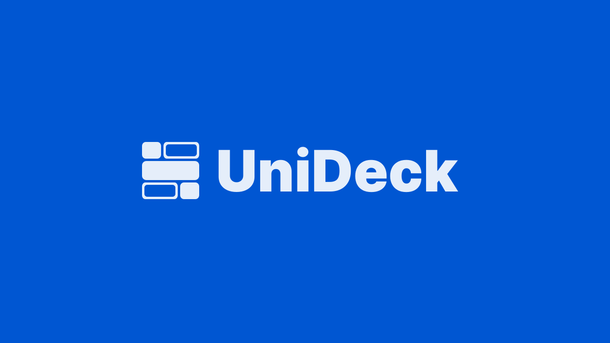

This Brand Kit consolidates UniDeck’s core visual elements-logos, symbols, and color palette-into a single reference, ensuring consistency across all digital and print materials.

## Logos

UniDeck’s wordmark is available in three variants to suit various contexts:

* **Color** (Tang Blue on white)
* **White** (Alice Blue on dark backgrounds)
* **Black** (monochrome applications)

Feel free to use any of these versions, but always choose the one that delivers the best legibility against its background ([ainur.gitbook.io](https://ainur.gitbook.io/unideck-docs/community/brand-assets "Brand Assets | UniDeck Docs")).

## Symbol

The standalone "UniDeck logo" can be used when UniDeck is already recognized in context (e.g., app icons, badges, or favicons). It echoes the logo’s color variants:

* **Color** (Tang Blue)
* **White** (Alice Blue)
* **Black** (monochrome)

Reserve symbol-only usage for instances where the full wordmark is implied or displayed elsewhere.

## Color Palette

UniDeck’s signature colors support a clean, modern look and should be applied consistently:

* **Tang Blue**
* **Black**
* **Alice Blue**

These swatches are the foundation of UniDeck’s UI components, marketing graphics, and printable materials.

## Accessing Assets

All logo, symbol, and color-swatch files are hosted in this repository (SVG/PNG) and also available on UniDeck Docs (PNG) under **Community → Brand Assets**. You can view and download them here:

> [https://ainur.gitbook.io/unideck-docs/community/brand-assets](https://ainur.gitbook.io/unideck-docs/community/brand-assets) ([ainur.gitbook.io](https://ainur.gitbook.io/unideck-docs/community/brand-assets "Brand Assets | UniDeck Docs"))
